<br/>
<div align="center">
  
  <p></p>
  
</div>
<br/>

## AwesomePlaces - application for search  interesting places

**AwesomePlaces** its a mobile application for search and discover interesting places in various categories such as culture, nature, entertainment and many more. The application was created in the [Dart](https://dart.dev/) language using the [Flutter](https://flutter.dev/) framework, which allows you to create beautiful and responsive user interfaces on various platforms. Interesting places are shared by very simple API, created in ASP.NET Core which is currently hosted in [Azure Web App Service](https://azure.microsoft.com/en-us/products/app-service/web). The application is designed for people who like to travel and discover new places, as well as for those who are looking for inspiration for their next trips. The application is designed to make it easier for users to find interesting places and share them with others. The application allows users to browse available places by category, location or name. Users can also add their own places, rate and comment on existing ones, and create lists of favorite places. The application also offers a map function that shows the location of selected places and how to navigate to them.

<br/>
<div align="center">
    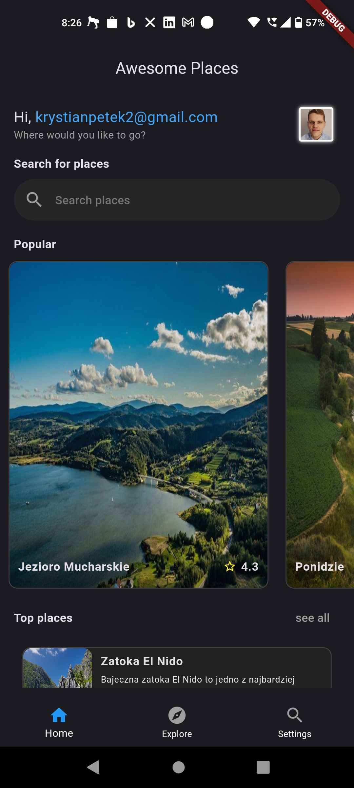
    
</div>

## Run the application

### WebAPI

To start the WebApi, you need to have the [.NET 7.0 SDK](https://dotnet.microsoft.com/en-us/download/visual-studio-sdks) installed on your computer. Then, in the project directory `AwesomePlaces.Api`, you can run the following commands:

```powershell
  dotnet restore
  dotnet run
```

After start backend API project, you can access to his documentation at the following address: [https://localhost:7098/swagger/index.html](https://localhost:7098/swagger/index.html). API documentation is compatible with [OpenAPI Specification 3.1](https://swagger.io/specification/) by Swagger. To invoke API endpoints you can use [Swagger UI](https://swagger.io/tools/swagger-ui/) or [Postman](https://www.postman.com/). To use SwaggerUI you need to authorize, you need first register new user and then login to get access token. To do this, you can use the following endpoints:

- `POST /users/register` - register new user
- `POST /users/login` - login user and get access token from response

### Mobile

To start the mobile application, you need to have the [Flutter SDK](https://flutter.dev/docs/get-started/install) installed on your computer. Then, in the project directory `AwesomePlaces.MobileUI`, you can command for install package dependencies, run the following commands:

```powershell
  flutter pub get
`````

To run the app use the following command:

```powershell
  flutter run --flavor dev -t .\lib\main.dart
```

and the last step, select the device on which you want to run the application:

<div>
  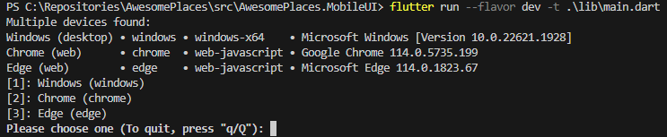
</div>

after that, the application should start on the selected device, and should look like this:

<div align="center">
<br/>
  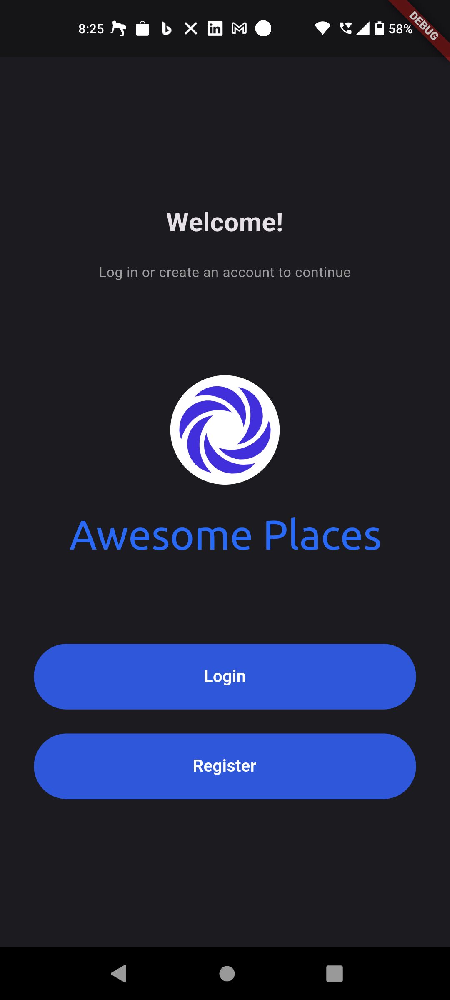
</div>

## Project architecture

The project was created using the following technologies:

### Back-end

- `ASP.NET Core 7` - framework for creating web applications, APIs and services
- `Entity Framework Core` - ORM (Object Relational Mapper) to map objects to relational databases, in this case the `InMemory` database
- `Dapper` - ORM for mapping objects to relational databases, in this case it is the `Sqlite` database (relational database in the form of a file)
- `FluentValidation` - library for model validation, checking the correctness of input data to the API with `IEndpointFilter` in middleware of ASP.NET Core
`Swagger` - a tool for documenting and querying the API

### Front-end

It's the simple **searching platformm** app built as **Modular Monolith**, written in **Flutter 3**. Each module is an independent **vertical slice** with its custom architecture, and the overall application architecture has been divided into features.

- `Flutter` - a framework for creating mobile, web and desktop applications
- `flutter_riverpod` - a library to manage application state
- `go_router` - app navigation library
- `uuid` - library for generating unique identifiers
- `http` - library for making HTTP requests
- `shared_preferences` - a library for saving data in the device's memory
- `location` - a library for retrieving the location of the device and taking care of location permissions
- `google_maps_flutter` - library for displaying Google maps
- `flutter_svg` - library for displaying SVG images

The entire application solution has been divided into 5 layers, 4 for the back-end, in relaying on Clean Architecture, and one for the front-end. The layers have been divided as follows:

<div align="center">
  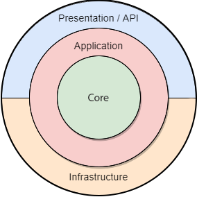
</div>
<br/>

- `AwesomePlaces.Core` - domain layer, containing domain entities, specifically: `Place`, `Address` and `Coordinate` and identity entities `User` and `Role`, as well as public contracts to repositories of these entities, contracts to services domain names and exceptions. This layer does not depend on any other layer, it has no external dependencies, it is the most inner layer.

- `AwesomePlaces.Application` - the application layer containing the business logic of the application, in this case these are application services that use domain service contracts from the `AwesomePlaces.Core` layer, which are then used in controllers to separate database repositories from models passed in controllers, it's another level of abstraction, that was created. In this layer, there are also DTO (Data transfer object) models with them validators, that pass data via the public interface in `AwesomePlaces.Api`, and later in the next stage, before performing operations on the database, they are mapped to domain entities. This layer depends on the domain layer, but no longer depends on any external layers.

- `AwesomePlaces.Infrastructure` - the infrastructure layer, contains implementations of interfaces from the `AwesomePlaces.Core` layer, in this case these are repository implementations that use the `InMemory` database with `Entity Framework Core` and `Sqlite` with the support of `Dapper`, as well as implementations of application services that use repositories. In this system, this layer contains implementations of repositories that are used in application services. This layer depends on the `AwesomePlaces.Application`, it inherits from the domain layer because there is inheritance from the application layer. It is a layer that combines external dependencies with the domain layer, but using abstractions in the domain and application layer, the dependence of external entities from the project's business rules has been separated. The infrastructure layer is mainly used to communicate external dependencies not directly related to the project's business theme, such as a database, file system or external API.

- `AwesomePlaces.Api` - API layer, contains controllers that are responsible for handling HTTP requests that are sent to the API. This layer also contains the Swagger configuration, which is used to document the API and to test endpoints, with the implementation of authentication using the JWT token (Json Web Token). This layer depends on the application layer by inheriting from the infrastructure layer, because it uses application services that are used in controllers. This layer is the outermost layer, because it is the layer that is visible to the end users of the system, because it is here that endpoints are issued that are used by client applications to communicate with the API. This layer is directly dependent only on the infrastructure layer. A global error handling system has also been implemented here, which is used in controllers to return appropriate HTTP error codes, depending on what error occurred in the system, and to ensure that the application is not stopped by an unhandled exception.

- `AwesomePlaces.MobileUI` - mobile application layer, contains all front-end application features, which is divided into `features`, `routes`, state `providers` and shared `widgets`. Each feature has, depending on its size, a `presentation` layer with views and a `data` layer containing models used in the module, services or validators, performing I/O, HTTP etc. operations. The `models` layer contains the models used in the application, which are mapped from the DTO models from the `AwesomePlaces.Application` layer, while the `services` layer contains the services used in the application that are used to communicate with the API, mapping, serialization, deserialization of classes and the `presentation` layer contains the user interface application. The `routes` layer contains the application navigation system, which is based on the `go_router` library, which is used to navigate between application views. The `providers` layer contains the application state management system, which is based on the `flutter_riverpod` library, which is used to manage the application state. The `widgets` layer contains shared widgets that are used in the application, such as buttons, text fields, etc.

## Features

Awesome Places is an application for searching interesting places around the world.

- Browse a list of interesting places by category or location
- Display the detailed data of the places, such as name, location, description, rating and images.
- The user can search for places by keywords, categories or location, and view the details of each place on a separate screen.
- The user can also save their favorite places to a local database and access them offline (WIP).
- The user can share your opinions and ratings with other users
- Application allows to add your own places to the API and contribute to the community
- You can use the map to find places near you and navigate to them
- The application has a simple and elegant user interface, with dark and light themes available.

## Screenshots

| | | |
| :-------------------------:|:-------------------------:|:-------------------------: |
|   |  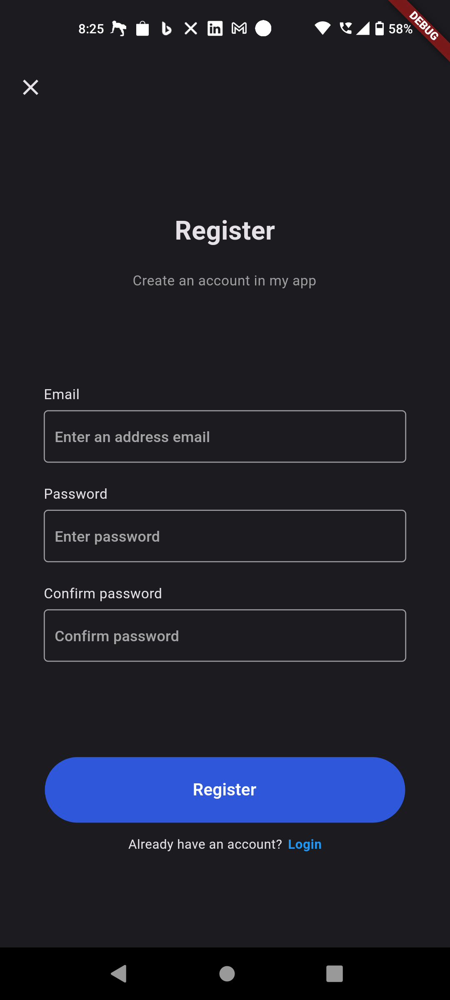 | 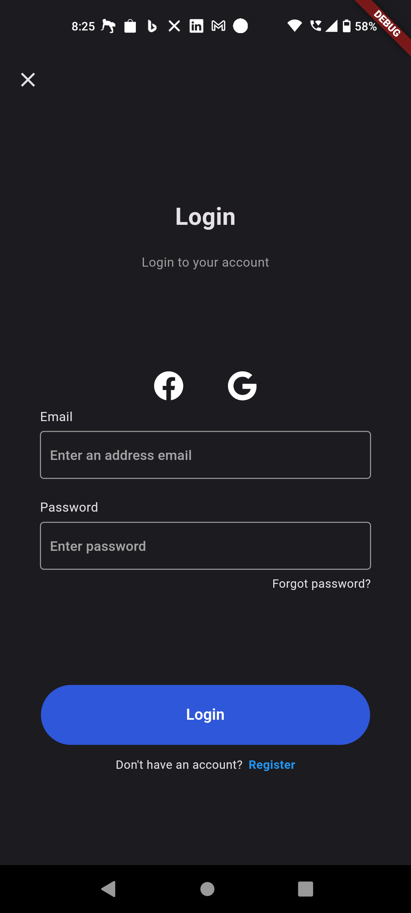 |
| 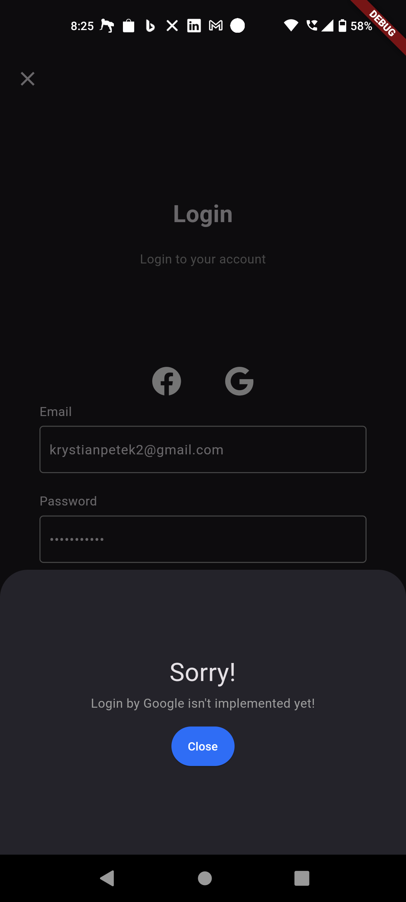  |  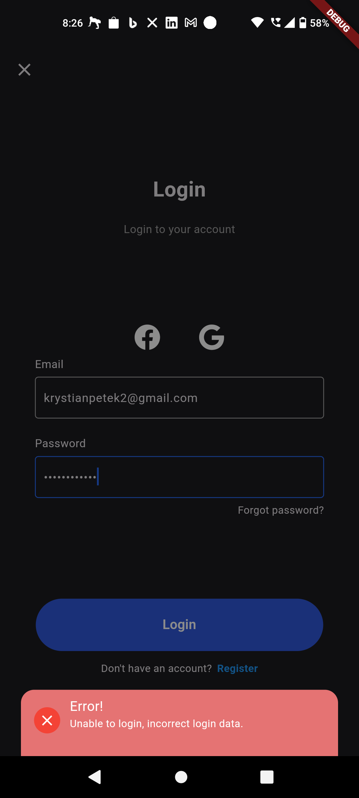 | 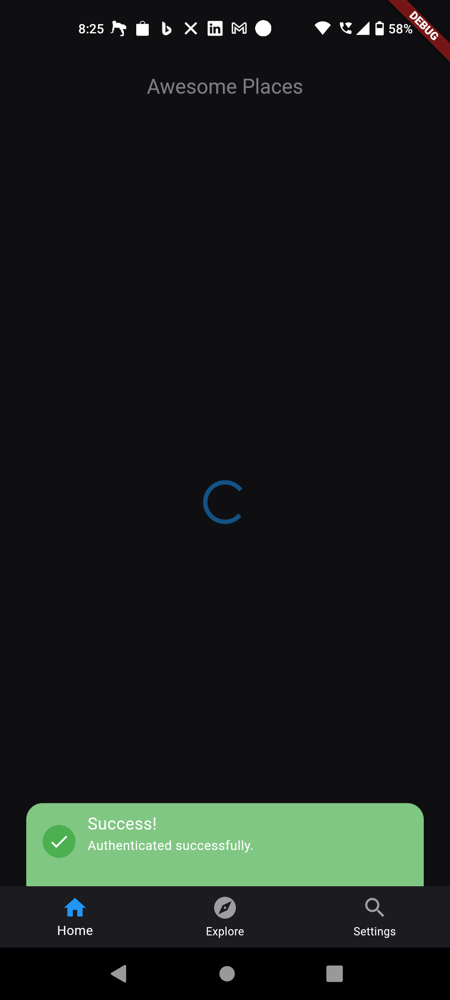 |
| 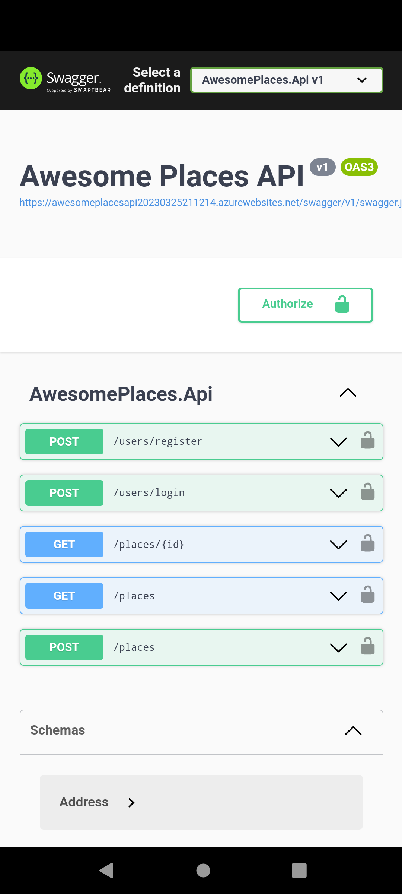  |  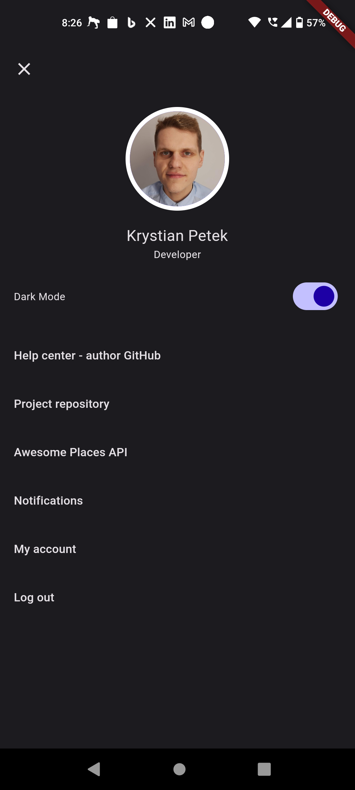 | 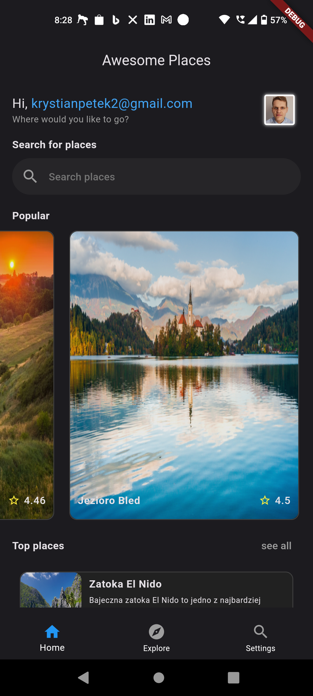 |
| 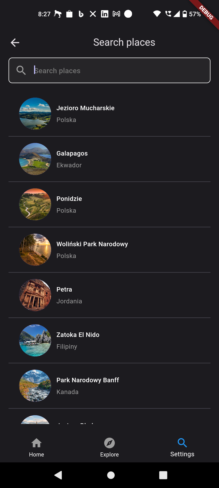  |  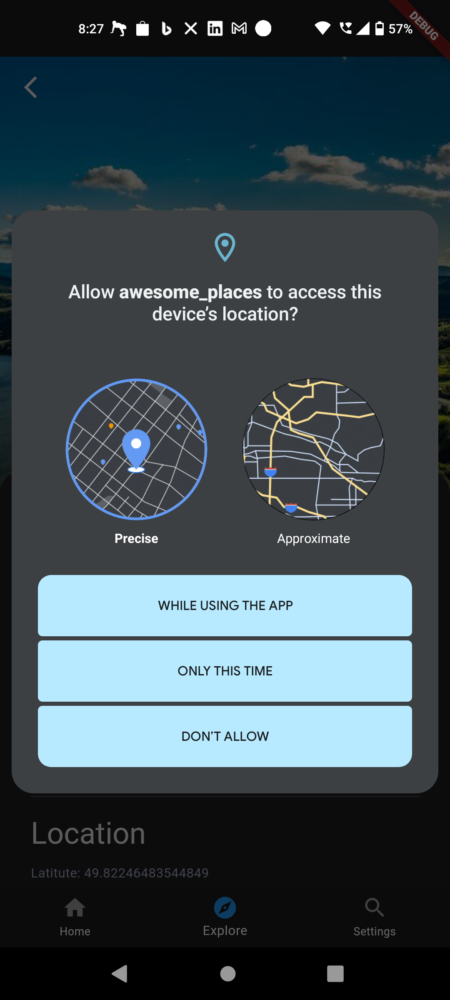 | 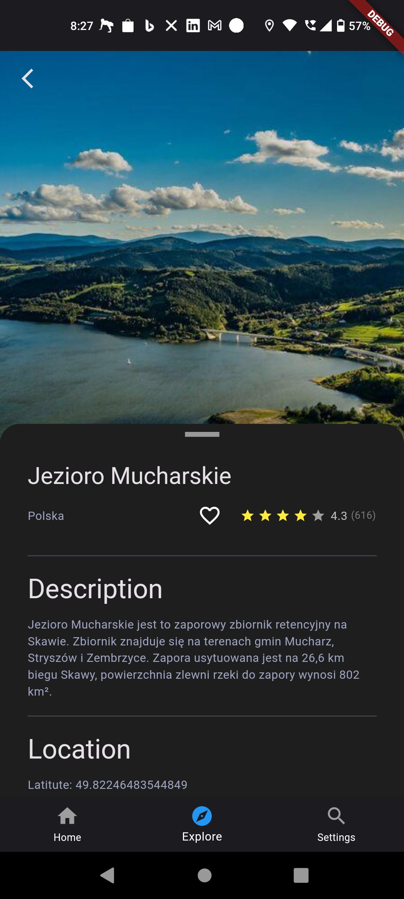 |
| 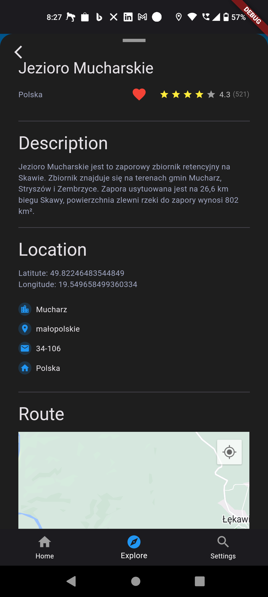  |  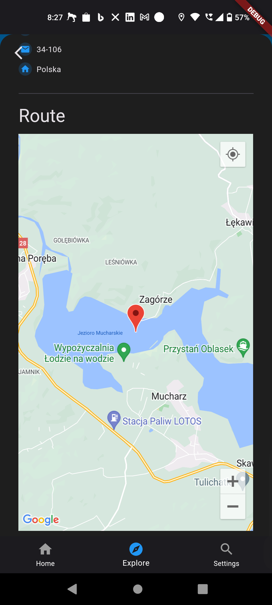 | 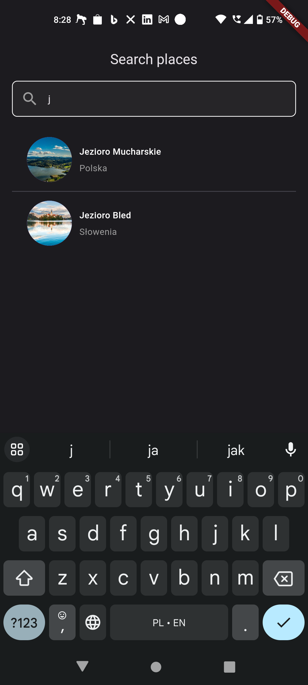 |
| 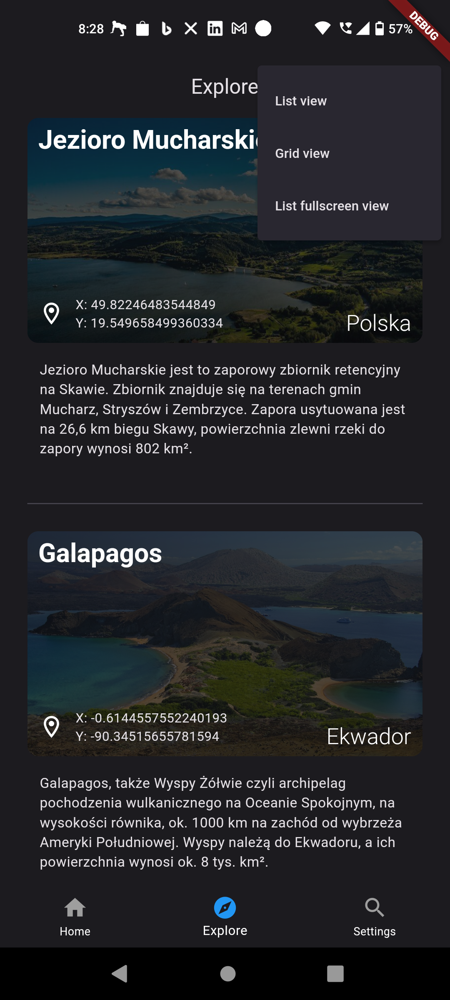  |  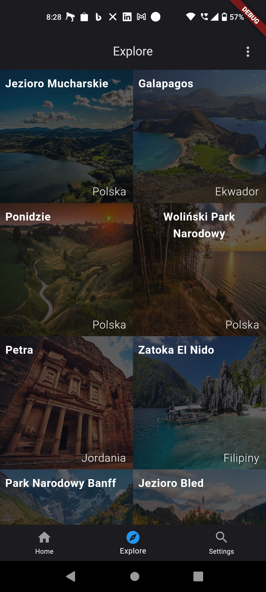 | 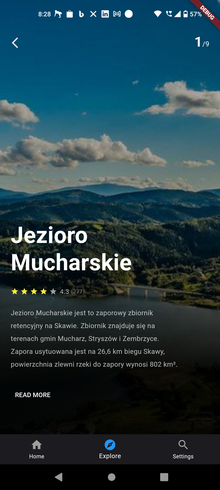 |
