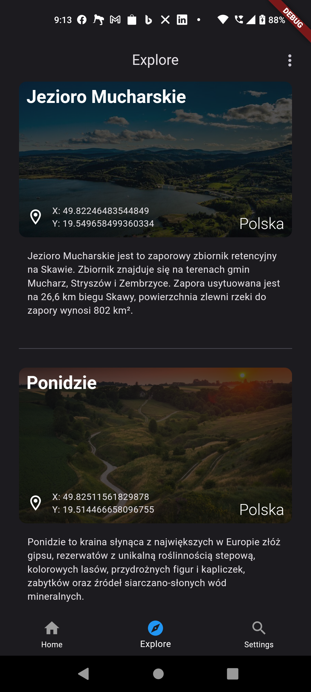

<div style="display:flex; justify-content: center; gap: 0.5rem; flex-direction: column; align-items: center;">
  
  
</div>

## AwesomePlaces - application for search  interesting places

**AwesomePlaces** its a mobile application for search and discover interesting places in various categories such as culture, nature, entertainment and many more. The application was created in the [Dart](https://dart.dev/) language using the [Flutter](https://flutter.dev/) framework, which allows you to create beautiful and responsive user interfaces on various platforms. Interesting places are shared by very simple API, created in ASP.NET Core which is currently hosted in [Azure Web App Service](https://azure.microsoft.com/en-us/products/app-service/web).

<div style="display:flex; justify-content: center; gap: 3rem; flex-direction: row; margin: 40px 0;">


</div>

## Run the application

### WebAPI

To start the mobile application, you need to have the [.NET 7.0 SDK](https://dotnet.microsoft.com/en-us/download/visual-studio-sdks) installed on your computer. Then, in the project directory `AwesomePlaces.Api`, you can run the following commands:

```powershell
  dotnet restore
  dotnet run
```

After start backend API project, you can access to his documentation at the following address: [https://localhost:7098/swagger/index.html](https://localhost:7098/swagger/index.html). API documentation is compatible with [OpenAPI Specification 3.1](https://swagger.io/specification/) by Swagger. To invoke API endpoints you can use [Swagger UI](https://swagger.io/tools/swagger-ui/) or [Postman](https://www.postman.com/). To use SwaggerUI you need to authorize, you need first register new user and then login to get access token. To do this, you can use the following endpoints:

- `POST /users/register` - register new user
- `POST /users/login` - login user and get access token from response

### Mobile

To start the mobile application, you need to have the [Flutter SDK](https://flutter.dev/docs/get-started/install) installed on your computer. Then, in the project directory `AwesomePlaces.MobileUI`, you can command for install package dependencies, run the following commands:

```powershell
  flutter pub get
`````

To run the app use the following command:

```powershell
  flutter run --flavor dev -t .\lib\main.dart
```

and the last step, select the device on which you want to run the application:

<div style="display:flex; justify-content: center; gap: 3rem; flex-direction: row; margin: 20px 0;">
  
</div>

after that, the application should start on the selected device, and should look like this:

<div style="display:flex; justify-content: center; gap: 3rem; flex-direction: row;  margin: 20px 0;">
  
</div>

      `Work in progress...`
